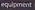
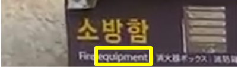
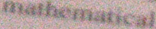
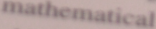
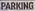
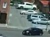
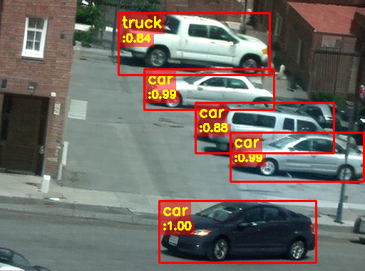
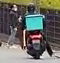
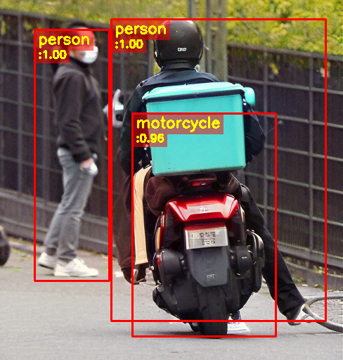

# Noise-Free One-Step LoRA for Task-Driven Image Restoration with Diffusion Priors

[**Paper**](https://arxiv.org/pdf/2607.25390)

[Jaeha Kim](https://jaehakim97.github.io/) and [Kyoung Mu Lee](https://cv.snu.ac.kr/index.php/kmlee/)

Seoul National University, Korea

## :loudspeaker: News
- **2026.08.13**: Code and pretrained models are released.

## :sparkles: Real-world demo results

| Task | Low-quality input | NOLA-IR result | Reference / GT |
|:---:|:---:|:---:|:---:|
| OCR | <br/>&nbsp; | <br/>Pred: `equipment` | <br/>&nbsp; |
| OCR | <br/>&nbsp; | <br/>Pred: `mathematical` | <br/>(GT from [SIDD](https://abdokamel.github.io/sidd/)) |
| OCR | <br/>&nbsp; | <br/>Pred: `parking` | – |
| Detection |  |  | – |
| Detection |  |  | – |
> Dashes (–) indicate that no ground-truth or reference image is available.
> For OCR, `Pred` denotes the text recognized from the restored image.

## :gear: Installation

### Requirements
- Python 3.10
- PyTorch 2.6.0 (CUDA 12.4 build)
- NVIDIA driver >= 525 (CUDA 12.x compatible)

```shell
conda create -n nola-ir python=3.10 -y
conda activate nola-ir
conda install numpy=1.26.4 -y
python -m pip install pip==25.3 setuptools==80.9.0 wheel
pip install torch==2.6.0 torchvision==0.21.0 torchaudio==2.6.0 --index-url https://download.pytorch.org/whl/cu124 --extra-index-url https://pypi.org/simple
pip install -r requirements.txt
python setup.py --download_sd_weights
```

The `--download_sd_weights` flag automatically downloads the pre-trained Stable Diffusion v2.1-base weights.
If you already have them, omit the flag and place the weights under `weights/stable-diffusion-2-1-base/`.

## :rocket: Quick start (real-world demo)

1. Download the pre-trained NOLA-IR checkpoints (`nola-ir_ocr_realworld.pt`, `nola-ir_det_realworld.pt`) from [**Google Drive**](https://drive.google.com/drive/folders/18Nfvn1m2SO3SmcHVOTdAa1Y6UoL9qwtg?usp=sharing).
2. Place them in the `weights/` directory.
3. Run:

```shell
# OCR
CUDA_VISIBLE_DEVICES=0 python run_demo.py --task ocr --input inputs/demo/ocr --output results/demo/ocr

# Detection
CUDA_VISIBLE_DEVICES=0 python run_demo.py --task detection --input inputs/demo/detection --output results/demo/detection
```
**Note:** You can also use your own images as input.
- **OCR**: Each image should contain a single word. We recommend a 4:1 (width:height) aspect ratio and a longer side below 256.
- **Detection**: We recommend keeping the input resolution below 512×512.

Restored images are upsampled so that the longer side is 512 by default.
For detection, a custom upscaling ratio can be set with `--scale`, but excessive values may introduce artifacts.

## <a name="inference"></a>:desktop_computer: Reproducing benchmark results

Below are the instructions for reproducing the results reported in our main manuscript.

#### Datasets

We evaluate on synthetically degraded versions of the following datasets:

| Task | Dataset | Degraded val set |
|:---:|:---:|:---:|
| Classification | CUB-200-2011 | [Download](https://drive.google.com/file/d/1ddROiJDr_VckR5G1fUwnUlBGtNbBLjHZ/view?usp=sharing) |
| Segmentation / Detection | VOC2012 | [Download](https://drive.google.com/file/d/1AivpVK9N4jWfsCLH2GI4z5iMnmaMu2iS/view?usp=sharing) |
| OCR | MJSynth | [Download](https://drive.google.com/file/d/1dLF4DQ3R2U3UB_JG1YqwIkydCTX8MddM/view?usp=sharing) |

Degradations are synthesized on-the-fly during training, while **validation sets are pre-generated and fixed** for consistent evaluation.

To exactly reproduce the numbers in our main table, use the pre-generated validation sets above.
Unzip them at the repository root; files will be placed under `datasets/source/`.
Alternatively, you can generate them yourself following [this instruction](assets/val-data-generation-instruction.md).

#### Checkpoints

1. Download the benchmark checkpoints from [Google Drive](https://drive.google.com/drive/folders/1Z7sTeVhNF_al4LU8abIebGeow9zNtIXK?usp=sharing) and unzip them at the repository root; files will be placed under `experiments/`. Each zip contains the NOLA-IR checkpoint (e.g., `009_nola-ir-tpgan`) along with the HQ and LQ baselines (`000_hq`, `001_lq`) used in our main table.

2. Download the HQ-trained task models ([weights_hq_models.zip](https://drive.google.com/file/d/1g0kthfc8tajehKe59sXfTjBJByfurAoj/view?usp=sharing)), which are required for TFD computation, and unzip them at the repository root; files will be placed under `weights/`.

#### Command

Evaluate our model with the following commands:

```shell
# Classification (CUB200)
CUDA_VISIBLE_DEVICES=0 python run.py --config configs/classification/cub200/eval/009_nola-ir-tpgan.yaml

# Segmentation (VOC2012)
CUDA_VISIBLE_DEVICES=0 python run.py --config configs/segmentation/voc2012/eval/009_nola-ir-tpgan.yaml

# Detection (VOC2012)
CUDA_VISIBLE_DEVICES=0 python run.py --config configs/detection/voc2012/eval/009_nola-ir-tpgan.yaml

# Optical character recognition (MJSynth)
CUDA_VISIBLE_DEVICES=0 python run.py --config configs/optical_character_recognition/mj/eval/006_nola-ir-tpgan.yaml
```

*NOTE*: All inference commands, including those for comparison methods, are available in [script.sh](script.sh).

## <a name="train"></a>:wrench: Train

*NOTE*: We recommend a GPU setup with at least **4×40GB** or **2×80GB** of memory. In our experiments, we used 4×A6000 or 2×H100 GPUs.

#### Datasets

| Task | Dataset | Download |
|:---:|:---:|:---:|
| Classification | CUB-200-2011 | [Kaggle](https://www.kaggle.com/datasets/wenewone/cub2002011?select=CUB_200_2011) |
| Segmentation / Detection | VOC2012 | [Kaggle](https://www.kaggle.com/datasets/gopalbhattrai/pascal-voc-2012-dataset) |
| Detection | COCO | [Official](https://cocodataset.org/#download) |
| OCR | MJSynth | [Dropbox](https://www.dropbox.com/scl/fo/zf04eicju8vbo4s6wobpq/ALAXXq2iwR6wKJyaybRmHiI?rlkey=2rywtkyuz67b20hk58zkfhh2r&e=2&dl=0)|

**CUB-200-2011 / VOC2012**: On the Kaggle page, click "Download" and select "Download dataset as zip" (login required). Place the downloaded `archive.zip` in `datasets/source/` and run:

```shell
python preprocess/cub200.py --remove_archive  # CUB200
python preprocess/voc2012.py --remove_archive  # VOC2012
```

These scripts extract the zip and reorganize the dataset to match our code.

:warning: Both Kaggle downloads are named `archive.zip`, so process one dataset at a time.

**COCO2017**: Used for real-world detection training. Unzip and place under `datasets/source/`, e.g., `datasets/source/COCO/train2017`.

**MJSynth**: Download `data_lmdb_release.zip` and unzip to `datasets/source/data_lmdb_release`. The link is provided by [deep-text-recognition-benchmark](https://github.com/clovaai/deep-text-recognition-benchmark#download-lmdb-dataset-for-traininig-and-evaluation-from-here).

#### Pretrained models

Download [codeformer_swinir.ckpt](https://huggingface.co/lxq007/DiffBIR-v2/resolve/main/codeformer_swinir.ckpt) and place it in `weights/`. (Used to initialize the SwinIR model; link provided by [DiffBIR](https://github.com/XPixelGroup/DiffBIR).)

#### Command

Training consists of three stages, e.g., for classification:

```shell
# 1. Pre-train the restoration model
CUDA_VISIBLE_DEVICES=0,1,2,3 accelerate launch --main_process_port 24177 run.py --config configs/classification/cub200/train/002_res-only.yaml

# 2. Train NOLA-IR
CUDA_VISIBLE_DEVICES=0,1,2,3 accelerate launch --main_process_port 24177 run.py --config configs/classification/cub200/train/008_nola-ir.yaml

# 3. Fine-tune with Task-Preserving GAN
CUDA_VISIBLE_DEVICES=0,1,2,3 accelerate launch --main_process_port 24177 run.py --config configs/classification/cub200/train/009_nola-ir-tpgan.yaml
```

For other tasks, replace the config path accordingly (e.g., `configs/segmentation/voc2012/train/...`).

*NOTE*: All training commands, including those for real-world detection on COCO, are available in [script.sh](script.sh).

## :star: Citation

Please cite us if our work is useful for your research.

```bibtex
@article{kim2026noise,
  title={Noise-Free One-Step LoRA for Task-Driven Image Restoration with Diffusion Priors},
  author={Kim, Jaeha and Lee, Kyoung Mu},
  journal={arXiv preprint arXiv:2607.25390},
  year={2026}
}
```

## :clap: Acknowledgement

Our implementation is inspired by [HYPIR](https://github.com/XPixelGroup/HYPIR). We appreciate their awesome work!

## :e-mail: Contact

If you have any questions, please feel free to contact me at `jhkim97s2@gmail.com`.
